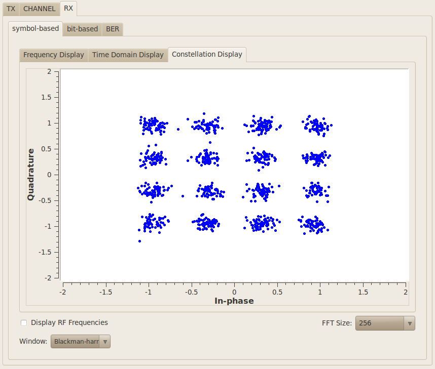

# PAM simulation

# About the simulation:
This simulation does:

1-Modulate bits using PAM constellation,

2-Adds White Gaussian Noise to modulated symbols.

3-Demodulate noisy symbols with threshold detection.

**OBS:** A Scrambler of bits were used to make symbols have equal probability
of happen.

# How to use

Open the simulation with:

<pre>#> gnuradio-companion simple_pam.grc</pre>

Run the simulation with:

<pre>F6</pre>

# About the parameters

## User defined parameters

### Transmitter/Receiver

* **samp_rate:** the sample rate of the simulation, also called the sampling frequency (in samples per second or, as some people prefer, Hz)

* **sps:** the oversampling factor, i. e., the number of samples per symbol

* **constellation_cardinality (M):**  number of symbols in constellation vector
the number of bits per constellaiton symbol can be seen as log2(M)

### Channel

* **snr_db**: signal to noise decibel level.

## Automatically calculated parameters

* **const_object:** Constellation object necessary for demodulation block, 
defines demodulation behavior.

Gnuradio have some Constellation objects already defined, 
this way we can just instanciate and use then, as:

<pre>
from gnuradio.digital.modulation_utils import type_1_constellations as constellations

constellations()['qam'](constellation_cardinality)
</pre>

* **constellation:** Constellation vector:

The constellation object instantiated before contains a constellation vector,
this way we just get a copy of it.

<pre>
const_object.points()
</pre>

For constellation object with constellation_cardinality = 4, the result is:

<pre>
((1+1j), (-1+1j), (-1-1j), (1-1j))
</pre>

* **constellation_power:** Constellation power calculated with python as:

<pre><code>sqrt(sum(abs(array(constellation))**2)/constellation_cardinality)</code></pre>

For constellation_cardinality = 4, the result is:

<pre>1.4142135623730951</pre>

* **noise_amp:** Noise amplitude calculated based on signal to noise decibel level
using the folowing python code, assuming signal have unitary power.

<pre>sqrt(  (10**(-snr_db/10.))  /2. )</pre>

# Post Simulation Scripts

While simulation runs all data are saved on files, this way
you can post process data, and calculate some other information
about simulation.

## BER calculations

The python script <pre>calc_ber.py</pre> defines a post script example that
compares transmitted and received data calculating the transmission Bit Error
Rate (BER), the SNR are calculated too, and you can compare it with the 
SNR chosen on **snr_db**.

