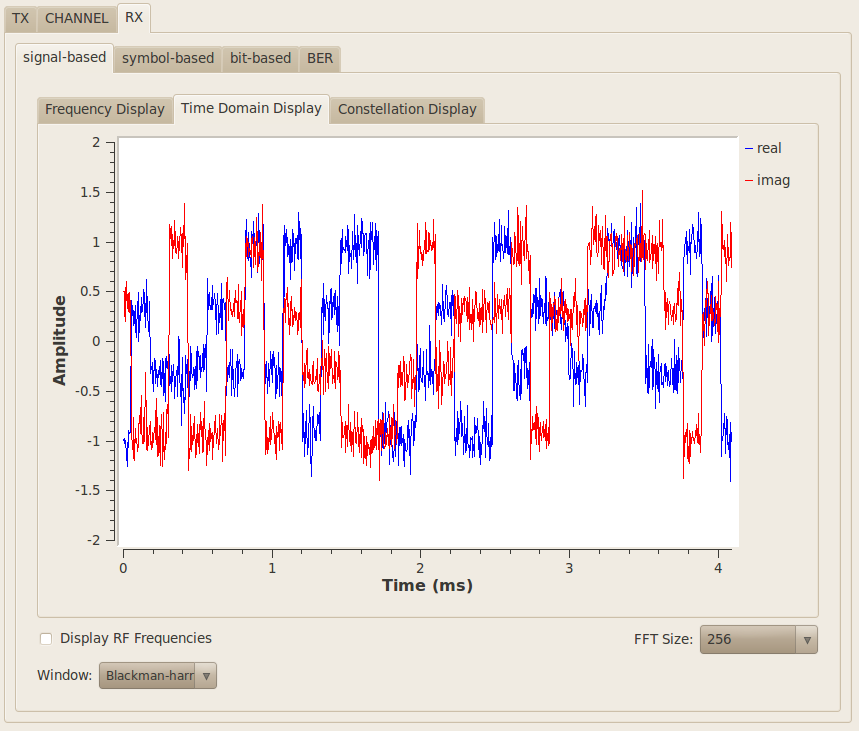

# Generic Modulation with Square Pulse Shape

# About the simulation:
This simulation does:

1-Modulate bits using generic constellation PAM, PSK or QAM.

2-Pulse shape modulated symbols with a square pulse

3-Adds White Gaussian Noise to shaped signal.

4-Extracts symbol from noisy signal

3-Demodulate extracted symbols with threshold detection.

**OBS:** A Scrambler of bits were used to make symbols have equal probability
of happen.

# How to use

Open the simulation with:

<pre>#> gnuradio-companion square.grc</pre>

Run the simulation with:

<pre>F6</pre>

# About the parameters

## User defined parameters

### Transmitter/Receiver

* **samp_rate:** the sample rate of the simulation, also called the sampling frequency (in samples per second or, as some people prefer, Hz)

* **sps:** the oversampling factor, i. e., the number of samples per symbol

* **constellation_type:** Define wich constellation to use: 'pam', 'qam', or 'psk'

* **constellation_cardinality (M):**  number of symbols in constellation vector
the number of bits per constellaiton symbol can be seen as log2(M)

### Channel

* **snr_db**: signal to noise decibel level.

## Automatically calculated parameters

* **pulse:** Define the shape of pulse, a sequence of '1' with **sps** elements

* **snr_after_filter:** Shows the SNR after pulse shaping recovery,
calculated here as:

<pre>snr_db + 10*log10(sps)</pre>

* **pam_constellation:** Gnuradio does not define a constellation object for PAM
then we need to create the constellation with:

<pre>
[complex(2*i - (constellation_cardinality)+1,0) for i in range(constellation_cardinality)] 
</pre>

* **pam_constellation_object:** Creates the constellation object for PAM
as shown in:

<pre>
import gnuradio

gnuradio.digital.constellation_rect(
    constellation,          # Constellation vector
    pre_diff_code,          # Differential code aplied after demodulation
    rotational_symmetry,    # Symetry of rotation
    real_sectors,           # Number of sector in real axis
    imag_sectors,           # Number of sector in imaginary axis
    width_real_sectors,     # Sector size in real axis
    width_imag_sectors      # Sector size in imag axis
)
</pre>

Specifically for PAM, we use:

<pre>
pre_diff_code = []
rotational_symmetry = 0
real_sectors = len(constellation)
imag_sectors = 0
width_real_sectors = 2
width_imag_sectors = 0
</pre>

* **const_object:** Constellation object necessary for demodulation block, 
defines demodulation behavior.

Gnuradio have constellation objects for QAN and PSK already defined,
we create the constellation object for PAM, then we need to choose
wich of then is used in **const_object**, as:

<pre>
from gnuradio.digital.modulation_utils import type_1_constellations as constellations

pam_constellation_object if constellation_type == 'pam' 
    else constellations()[constellation_type](constellation_cardinality)
</pre>

* **constellation:** Constellation vector:

With all constellation objects we can just use then to get constellation vector.

<pre>
const_object.points()
</pre>

* **constellation_power:** Constellation power calculated with python as:

<pre><code>sqrt(sum(abs(array(constellation))**2)/constellation_cardinality)</code></pre>

For constellation_cardinality = 4, the result is:

<pre>1.4142135623730951</pre>

* **noise_amp:** Noise amplitude calculated based on signal to noise decibel level
using the folowing python code, assuming signal have unitary power.

<pre>sqrt(  (10**(-snr_db/10.))  /2. )</pre>

# Post Simulation Scripts

While simulation runs all data are saved on files, this way
you can post process data, and calculate some other information
about simulation.

## BER calculations

The python script <pre>calc_ber.py</pre> defines a post script example that
compares transmitted and received data calculating the transmission Bit Error
Rate (BER), the SNR are calculated too, and you can compare it with the 
SNR chosen on **snr_db**.

